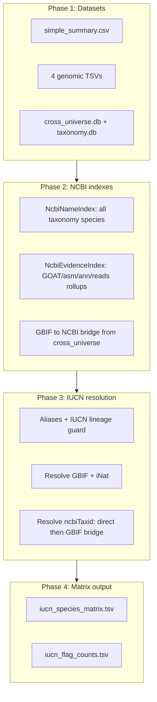
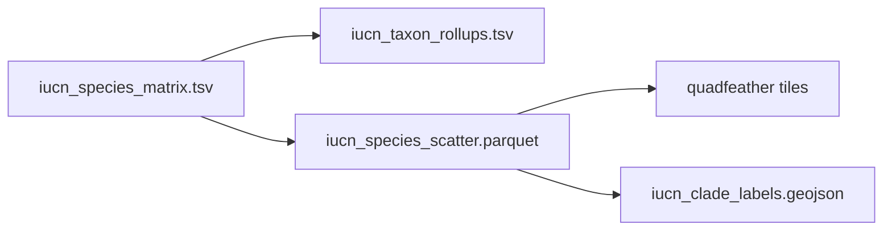

# IUCN Universe Pipeline

**Backbone:** IUCN Red List `simple_summary.csv` (~172,620 assessed species).  
**Goal:** One matrix row per IUCN species with boolean flags for GBIF, iNaturalist, and NCBI genomic evidence.

---

## End-to-end flow



### Entry point

```bash
python -m pipeline.build.matrix
python -m pipeline                              # weekly orchestrator
python -m pipeline --skip-download --limit 1000 # smoke test
```

Inputs live in repo-root **`datasets/`** and **`cache/`** (see [README.md](README.md)).

### Module map

| Module | Role |
|--------|------|
| `build/matrix.py` | Orchestrator: name index + evidence + resolve → write matrix + counts |
| `load_iucn_species.py` | Parse `simple_summary.csv` into `IucnSpecies` rows |
| `ncbi_evidence.py` | `NcbiNameIndex` (all species), `NcbiEvidenceIndex` (genomic flags), GBIF bridge |
| `iucn_resolver.py` | IUCN → GBIF/iNat/NCBI resolution |
| `species_rollup.py` | Per-source aggregation rolled up via `species_ancestor` |
| `taxonomy_db.py` | Query `taxonomy.db` |
| `match_keys.py` | Name normalization and binomial keys |

---

## Per-species resolution cascade

### Step 0 — Aliases

For each IUCN species:

1. `scientificName` (normalized lowercase)
2. `genusName + speciesName` binomial key

Lineage guard tokens: lowercased `genusName`, `familyName`, `orderName`, `className`, `phylumName`, `kingdomName` from `simple_summary`.

### Step 1 — GBIF (`iucn_resolver._resolve_gbif`)

| Lookup | Index |
|--------|-------|
| Exact alias | `gbif_name` JOIN `gbif_accepted` |
| Binomial | `gbif_binomial` JOIN `gbif_accepted` |

Genus/lineage guard disambiguates homonyms. Single surviving `gbif_id` → `hasGbif=1`.

### Step 2 — iNaturalist (`_resolve_inat`)

| Lookup | Index |
|--------|-------|
| GBIF canonical bridge | `inat_name` / `inat_binomial` |
| Exact alias | `inat_name` |
| Binomial | `inat_binomial` |

Same lineage guard. Single surviving `inat_id` → `hasInat=1`.

### Step 3 — NCBI taxonomy + genomic evidence

**Name index** (`NcbiNameIndex`) covers all species-rank names in `taxonomy.db` (not limited to genomic species).

| Method | When |
|--------|------|
| `direct` | Alias or unique binomial hits `name_to_sp` / `binom_to_sp`, with NCBI lineage guard |
| `bridge` | No direct match, but matched `gbifId` maps via `cross_universe` GBIF→NCBI tables |

On `ncbiTaxid` match → genomic flags copied from `NcbiEvidenceIndex` when evidence exists (taxid may be present with all genomic flags `0`). No match → empty `ncbiTaxid` and all genomic flags `0`.

---

## Flag semantics (camelCase matrix columns)

| Column | Meaning |
|--------|---------|
| `hasGbif` | Unique GBIF accepted record after lineage guard |
| `hasInat` | Unique iNat record after lineage guard |
| `ncbiTaxid` | NCBI species taxid when matched (replaces exported `hasNcbi`) |
| `hasGoat` | GOAT sequencing status present for matched NCBI species |
| `hasAssemblies` | ≥1 NCBI assembly for matched species |
| `hasAnnotations` | ≥1 Annotrieve annotation for matched species |
| `hasShortWgs` / `hasLongWgs` | ENA reads with `library_source=GENOMIC` |
| `hasShortTranscriptomic` / `hasLongTranscriptomic` | `library_source=TRANSCRIPTOMIC` |
| `has*SingleCell` | `GENOMIC SINGLE CELL` or `TRANSCRIPTOMIC SINGLE CELL` |

Long vs short is determined by instrument platform (Oxford Nanopore, PacBio = long).

Trace columns: `gbifId`, `inatId`, `ncbiMatchMethod`.

---

## Output files

| File | Description |
|------|-------------|
| `output/iucn_species_matrix.tsv` | One row per IUCN species: 19 summary cols + 13 flags + 4 trace cols |
| `output/iucn_flag_counts.tsv` | Per-flag true/false counts (`hasNcbi` derived from non-empty `ncbiTaxid` for diagnostics) |

---

## Weekly orchestrator fetch modes

| Mode | Steps | Behavior |
|------|-------|----------|
| **ensure** | `gbif`, `inat`, `ncbi_taxonomy` | Skip download when cached output exists |
| **refresh** | `iucn`, `assemblies`, `annotations`, `reads`, `goat` | Always `--force` re-fetch |

Default weekly steps: fetch + `cross_universe` + `matrix` + `manifest` (no stub `rollups`/`tiles` unless requested via `--steps`).

`cross_universe.db` rebuilds when GBIF/iNat/OTL cache inputs are newer than the DB mtime.

---

## Caveats

1. **Genomic flags require `ncbiTaxid`** — an IUCN species with GBIF/iNat but no NCBI match gets empty `ncbiTaxid` and all genomic flags `0`.
2. **Bridge is one-way** — GBIF→NCBI only; no reverse validation.
3. **Lineage guard is string equality** — orthographic variants between IUCN and GBIF won't match family/phylum checks.
4. **Binomial key is two tokens** — trinomial IUCN names may over-link on species-level external records.
5. **ENA multi-taxid rows skipped** — reads with `;`-separated taxids are ignored.

---

## Suggested follow-ups (not implemented)

- Next.js `/explore` deepscatter route wired to `site-data` tiles + GeoJSON labels

---

## Publish pipeline (local)

After matrix build, produce rollups, UMAP scatter parquet, quadfeather tiles, and clade labels:

```bash
python -m pipeline --skip-download \
  --steps matrix,rollups,scatter,tiles,labels,manifest
```



| Step | Module | Output |
|------|--------|--------|
| `rollups` | `build/taxon_rollups.py` | IUCN rank tree with species counts |
| `scatter` | `build/scatter_layout.py` | Parquet = matrix columns + `x`/`y` |
| `tiles` | `build/scatter_tiles.py` | `output/tiles/iucn/v{date}/` |
| `labels` | `build/clade_labels.py` | Kingdom/phylum centroid GeoJSON |

**Rollups** use IUCN `simple_summary` ranks (`kingdomName` → `speciesName`), not NCBI taxids. Columns are camelCase (`taxonKey`, `speciesCountTotal`, `speciesCountLc`, `speciesCountGbif`, …).

**UMAP layout** (`scatter_features.py`): conservation one-hot + lineage hash bag (kingdom→genus) → cosine UMAP, coords scaled to ±250.

**Tiles** require quadfeather: `uv add git+https://github.com/bmschmidt/quadfeather`
